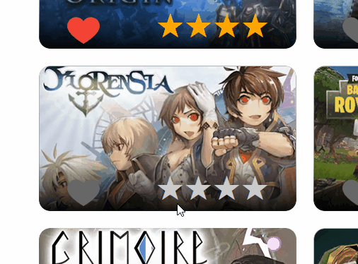

## Documentação
 ### Responsividade
- Header:


- Cards:


### Autenticação
- Criei a autenticação com o firebase, contando também com o campo "esqueci a senha" e com um sistema de alerta próprio, sem nenhuma biblioteca visual em todo projeto, apenas css modules.
  


### Animações
- Fiz animações utilizando apenas css, com keyframes.
- A animação do coração ocorre tanto no like quanto no deslike, sendo duas animações diferentes. Procurei animar não só os transform, mas também o preenchimento gradual do vermelho e cinza no coração. O efeitos no card também foram animados, assim como as estrelas.




### Filtros
- Os filtros foram implementados conforme o pedido e se encontram no próprio header.  
- É possível acionar o filtro de gênero tanto no menu dropdown quanto no card, por meio de um click no nome do gênero. Ao ser clicado novamente, volta-se a apresentar todos os resultados.
- Adicionei um botão que implementa uma busca ampla, que ajuda o usuário a encontrar jogos mesmo com o nome não sendo escrito perfeitamente.


### Estilos
- Procurei utilizar o mais próximo possível do css puro para construir o projeto, portanto fiz uso apenas do css modules para evitar conflito no escopo das classes. Além disso, tentei evitar a repetição de códigos, utilizando os context e hooks e mantendo uma boa estrutura de pastas. 
### Agradecimentos
- Agradeço imensamente a oportunidade de ter meu projeto visto. Irei levar o conhecimento adquirido neste projeto para toda a minha carreira. Muito obrigado!

## Getting Started

First, run the development server:

```bash
npm run dev
# or
yarn dev
# or
pnpm dev
```

Open [http://localhost:3000](http://localhost:3000) with your browser to see the result.

You can start editing the page by modifying `app/page.tsx`. The page auto-updates as you edit the file.

This project uses [`next/font`](https://nextjs.org/docs/basic-features/font-optimization) to automatically optimize and load Inter, a custom Google Font.
